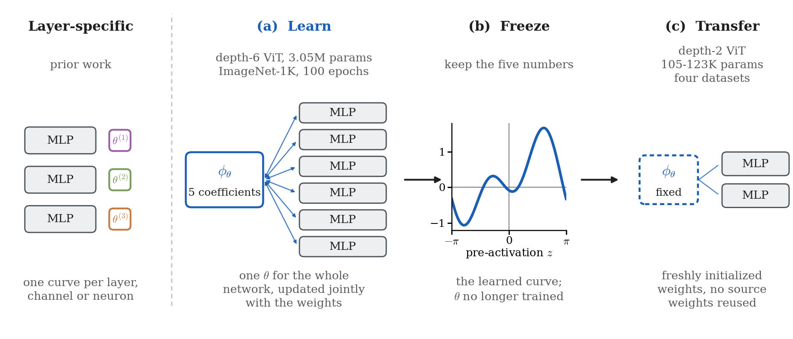

# FAct

One activation function for a whole network: five scalars, shared by every
hidden layer, learned jointly with the weights — then frozen and transferred
into a different network as an ordinary fixed activation.

$$\phi(t) = a_0 + \sum_{k=1}^{K} a_k \cos(k\omega t) + b_k \sin(k\omega t)$$

At `K = 2` that is five learnable scalars at any depth. Conventional learnable
activations attach their parameters to a layer, channel or neuron, so no single
curve is *the* network's nonlinearity. This one is, and can be lifted out.

From the paper *Towards Transferable Activation Functions*.

<p align="center">
  
</p>

<p align="center">
  <sub><b>Left, for contrast:</b> a conventional learnable activation attaches its parameters to
  individual layers, channels or neurons, so a trained network holds many curves and no single one
  of them is the network's nonlinearity. <b>(a)</b> FAct instantiates one parameter set θ, five
  coefficients in total, and every feed-forward block applies the same φ(θ); the
  coefficients are updated jointly with the weights and receive gradients from every block.
  <b>(b)</b> After source training the five coefficients are frozen — the curve shown is the
  transferred one, a₀ = 0.218, a₁ = 0.119, a₂ = −0.424, b₁ = 0.832, b₂ = −0.592, over one period
  [−π, π]. <b>(c)</b> It is installed as an ordinary fixed activation in a smaller, independently
  initialized target network, which receives no weights from the source model and does not update
  the activation parameters.</sub>
</p>

## Install

```bash
pip install -e .                  # the activation: torch, numpy, scipy
pip install -r requirements.txt   # + what the training code and tools need
```

## Use

```python
from fact import FrozenFAct, FAct, count_activation_parameters

act = FrozenFAct()                 # the curve learned on ImageNet-1K, 0 parameters
model = MyNetwork(activation=act)  # drop-in for nn.GELU()

act = FAct(K=2)                    # or learn a fresh one, GELU-initialised
model = MyNetwork(activation=act)  # pass ONE instance to every block
assert count_activation_parameters(model) == 5
train(model)
frozen = act.freeze()              # -> FrozenFAct, ready to transfer
```

Sharing one instance across every block is the mechanism, not an optimisation.
Constructing one per block gives each block its own curve, which is a different
method; `count_activation_parameters` is the cheap way to check.

## Checkpoints

| File | Model | Trained on | Activation |
|---|---|---|---|
| `vit_d6_imagenet1k_fact_k2_seed1_final.pt` | ViT-d6, 3,048,237 params | ImageNet-1K, 100 ep, seed 1 | **Learnable FAct**, 5 trainable |
| `vit_d6_imagenet1k_gelu_seed1_final.pt` | ViT-d6, 3,048,232 params | ImageNet-1K, 100 ep, seed 1 | GELU, fixed |
| `vit_d2_<dataset>_frozen_fact_seed<N>_best.pt` | ViT-d2, 105K-123K params | 4 datasets, 23 runs, 100 ep | **Frozen FAct**, 0 trainable |

35 MB total; each holds a `state_dict`, the run `config` and its recorded
accuracy. The +5 parameters between the first two are the whole mechanism; the
rest are that same curve, frozen, inside a smaller network.

The 23 target checkpoints are the transfer result itself — one curve, lifted out
of the ImageNet-1K source run above and installed unchanged in four independently
initialised ~100K ViTs. Their own recorded accuracies reproduce the paper's
shared-hyper-parameter transfer table:

| Dataset | Params | Seeds | Test top-1 |
|---|---|---|---|
| Fashion-MNIST | 105,098 | 0-5 | 90.95 ± 0.10 |
| CIFAR-10 | 108,106 | 0-5 | 75.45 ± 0.40 |
| CIFAR-100 | 113,956 | 0-5 | 47.79 ± 0.52 |
| Food-101 | 123,237 | 1-5 | 35.76 ± 0.33 |

Food-101 ships five of the six seeds. Seed 0's best-validation checkpoint did not
survive the run that produced it — the file left on disk is the mid-run flush
from epoch 23, not the epoch-83 model the paper scored — so it is omitted rather
than shipped with the wrong weights under the right name. The paper's Food-101
figure, 35.82 ± 0.33, is the six-seed mean and includes it.

```bash
python tools/check_checkpoints.py     # --skip-eval to skip the dataset
```

Rebuilds each model from `code/`, loads it with `strict=True`, confirms the five
coefficients are bit-identical across the source weights, `fact/coefficients/`
and all 23 sets of target weights, checks every target seed against the paper's
mean, and re-evaluates the CIFAR-10 seed-0 target to its recorded 75.87%.
46 checks (44 with `--skip-eval`).

Note the source files are the **final**-epoch checkpoints. FAct seed 1 peaked at
epoch 100, so its final checkpoint records the paper's 65.12%; GELU seed 1
peaked at 97, so its final checkpoint records 62.62% where the paper's
best-validation figure is 62.50%.

## Baselines

Two other globally shared learnable activations are included, each built and
shared exactly as FAct is — one instance handed to every feed-forward block, so
the whole network has one curve:

| `ffn_kind` | Activation | Learnable activation params |
|---|---|---|
| `fact_k2_global` | Fourier series, K = 2 | 5 |
| `pau_global` | Pad&eacute; Activation Unit, order (5,4) | 10 |
| `acon_c_global` | ACON-C | 3 |

`pau_global` follows Molina et al., *Pad&eacute; Activation Units*, ICLR 2020:
f(t) = P(t)/Q(t) with P of degree 5 and Q of degree 4. Note that Q is
1 + &sum;<sub>k</sub> |b<sub>k</sub>| t<sup>k</sup>, the absolute value taken
per coefficient, and **not** that paper's pole-free "safe" form
1 + |&sum;<sub>k</sub> b<sub>k</sub> t<sup>k</sup>|: Q &ge; 1 does not hold
here, and a large enough odd |b<sub>k</sub>| puts a real root in Q. The runs
here stay clear of one (the trained curve's minimum is Q = 0.855 at
t = &minus;0.427), but it is not guaranteed &mdash; see `PAU`'s docstring.
It starts from a least-squares Pad&eacute; fit to GELU on
[&minus;&pi;, &pi;] — the same "start as a faithful copy of a known-good
activation" convention as FAct's `init="true"`. `cuda_pau/` is a fused CUDA
kernel for it, which is what makes it affordable: pure-PyTorch Pad&eacute; keeps
t&hellip;t&sup5; live for backward and costs 24.6 GiB per Food-101 fine-tune cell
against the kernel's 5.9.

## Food-101 transfer

`code/food101/finetune_food101.py` fine-tunes a source checkpoint on Food-101 at
the *source* geometry (224px, patch 16), so `patch_embed`, `pos_embed` and
`cls_token` transfer along with the body and only the 101-way head is fresh.
`--linear-probe` instead freezes every transplanted tensor and trains that head
alone, 19,493 of 2.87M parameters.

```bash
PYTHONPATH=code/source_vit python code/food101/finetune_food101.py \
    --dataset food101_224 --variant pau_global --pretrained-ckpt SOURCE.pt \
    --data-root $FACT_DATA_ROOT --out-dir runs/food101_pau \
    --epochs 100 --batch-size 256 --lr 1e-4 --wd 0.05 --warmup-epochs 2 \
    --depth 6 --seed 0 --use-cuda-act
```

Five seeds at each arm's validation-selected learning rate, test top-1:

| Source activation | Fine-tuned | Linear probe |
|---|---|---|
| **Learnable FAct** (5 coefficients) | **78.29 ± 0.12** | 58.89 ± 0.09 |
| Learnable PAU (10 coefficients) | 77.93 ± 0.18 | **58.91 ± 0.24** |
| GELU | 77.07 ± 0.33 | 56.96 ± 0.30 |

The two settings separate the parameterization from the mechanism. Under the
linear probe the two learnable activations are indistinguishable — seed-matched
difference −0.01 ± 0.19 pp (*t*(4) = −0.17, *p* = 0.88) — while both beat GELU by
the same amount (+1.93 ± 0.30 and +1.94 ± 0.45 pp, overlapping intervals). Under
full fine-tuning FAct stays ahead of PAU by +0.36 ± 0.23 pp, positive at every
seed, with half as many activation coefficients. So the advantage over a fixed
activation comes from sharing *a* learnable curve across the network rather than
from the Fourier basis, and what the Fourier basis adds shows up only once the
whole network adapts. Appendix G of the paper carries the learning-rate grids,
the per-seed tables and the caveats; these checkpoints are not in this
repository.

## Layout

```
fact/           the activation: FAct, FrozenFAct, the transferred coefficients
checkpoints/    the 25 models above: 2 source, 23 transferred
code/
  source_vit/   depth-6 ViT, ImageNet-1K -- where the curve is learned
    cuda_pau/   fused CUDA kernel for the PAU baseline
    cuda_fact_k2/  fused CUDA kernel for FAct at K=2
  target_vit/   depth-2 ViT and the fixed-activation zoo -- where it is reused
  food101/      Food-101 fine-tune / linear-probe driver (224px, patch 16)
tools/          check_checkpoints.py, build_dataset_cache.py
tests/          pins fact/ element-wise to the code that produced the results
```

`fact/` is a dependency-light consolidation of the study code; `tests/` checks
the two agree, so what you import is what produced the target-scale numbers.
(The one place the two scales differ is the GELU-fit initialisation: `fact/`
follows `code/target_vit/`, and `code/source_vit/` uses a more accurate
quadrature, ~8e-4 apart at K=2. See `fourier_fit`'s docstring.)

## Data

```bash
export FACT_DATA_ROOT=/path/to/datasets
python tools/build_dataset_cache.py             # CIFAR-10/100, ~740 MB, a few minutes
python code/source_vit/download_imagenet1k.py   # ImageNet-1K parquet, ~150 GB, hours
```

ImageNet-1K is gated: accept the terms at
[ILSVRC/imagenet-1k](https://huggingface.co/datasets/ILSVRC/imagenet-1k) and
authenticate (`hf auth login`, or set `HF_TOKEN`) before running its downloader.

The training code reads CIFAR-10/100 as one pre-decoded tensor per split from
`$FACT_DATA_ROOT/hf/` rather than through `torchvision.datasets.CIFAR10`: every
activation sees the identical tensor, so the variants differ in the nonlinearity
and nothing else. `build_dataset_cache.py` decodes those tensors from the
HuggingFace parquet release and checks them against the SHA-256 of the caches
the published runs read — row order is load-bearing, since it fixes the
validation carve-out and every augmentation draw, and torchvision's order is not
the same one. Fashion-MNIST and Food-101 need nothing: torchvision fetches them
on demand.

## Training

```bash
python code/target_vit/train_static.py --arch vit --dataset cifar100 --epochs 100 \
    --act fact_fixed --seed 0 --out-dir runs/cifar100_fact_fixed
python code/source_vit/cv_train.py --dataset imagenet1k --variant fact_k2_global --seed 1 --epochs 100
python code/source_vit/cv_train.py --dataset imagenet1k --variant pau_global --seed 1 --epochs 100 --use-cuda-act
```

**Pass `--epochs 100` to reproduce the paper.** `train_static.py`'s built-in
per-dataset budgets are shorter than the paper's protocol (Fashion-MNIST 20,
CIFAR-10 40, CIFAR-100 60; they are inherited from the experiments these arms
were first compared against), while every number in the paper's target tables
comes from a 100-epoch run — as the shipped `vit_d2_cifar10_*` checkpoint's own
`config` records. On CIFAR-10 the default 40-epoch budget lands ~3 pp low, which
is enough to invert the ranking against the fixed-activation baselines.

The fused CUDA kernels (`fact_fixed`, and `--use-cuda-act` at source scale) are
JIT-compiled on first use and need a working `nvcc` from a system CUDA toolkit
and `ninja` on `PATH` (`requirements.txt` installs it; `pip install -e .` alone
does not, and `torch` does not depend on it). `--no-cuda-kernel` selects the
equivalent pure-PyTorch path instead.

Python ≥ 3.9, PyTorch ≥ 2.0. The published runs used Python 3.12 and PyTorch 2.10.
`--use-cuda-act` is effectively required for `pau_global`: pure-PyTorch Padé
keeps t…t⁵ live for backward, which does not fit at this batch size.

## Citing

```bibtex
@article{fact2026,
  title   = {Towards Transferable Activation Functions},
  author  = {A, Arun Prakash and Khapra, Mitesh M.},
  journal = {arXiv preprint arXiv:XXXX.XXXXX},
  year    = {2026}
}
```

MIT — see [LICENSE](LICENSE).
